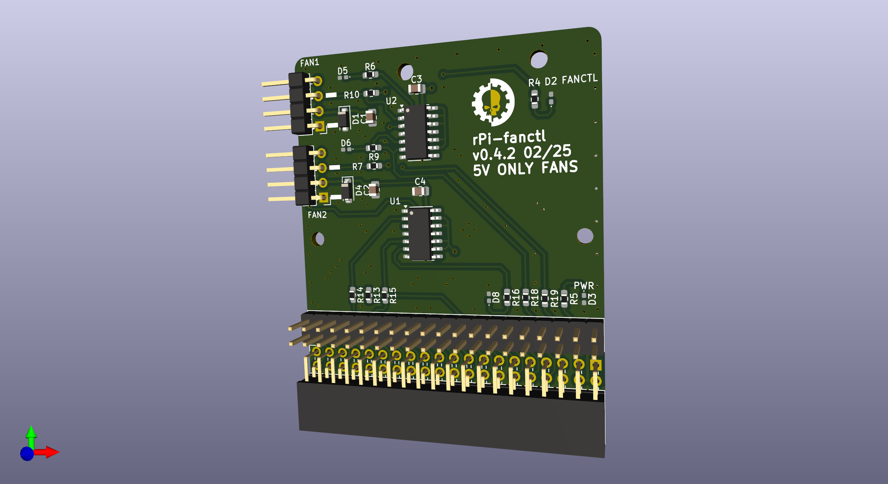

This is a replacement pcb for the [ElectroCookie Raspberry Pi 4 Case, Aluminum Mini Tower Case](https://www.amazon.de/dp/B09R6TZCQ8) (or probably [this one](https://www.amazon.de/dp/B09QG349ZL)) to be used with PWM controlled 5V fans like [noctua NF-A4x10 5V PWM, 4-Pin](https://www.amazon.de/dp/B07DXS86G7).

You might also need a [3D printed fan adapter](https://www.thingiverse.com/thing:2995904).

